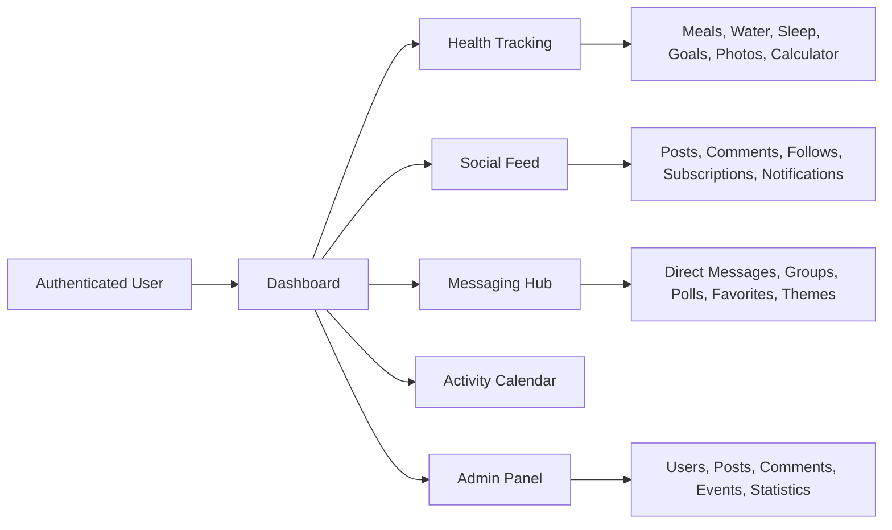

<div align="center">

# FitLife

### Fitness tracking, social momentum, and full-featured messaging in one Laravel application.

<p>
  
  
  
  
  
</p>

<p>
  
  
  
  
</p>

<p>
  <a href="#overview">Overview</a> •
  <a href="#project-snapshot">Snapshot</a> •
  <a href="#architecture">Architecture</a> •
  <a href="#core-modules">Modules</a> •
  <a href="#quick-start">Quick Start</a> •
  <a href="#testing--quality">Testing</a> •
  <a href="#repository-map">Repository Map</a>
</p>

</div>

---

## Overview

FitLife is a Laravel-based fitness platform that merges personal tracking with community features. It covers the day-to-day health workflow of a user, then layers social discovery, direct messages, group chats, polls, notifications, and moderation on top.

Instead of splitting the experience across multiple small tools, FitLife keeps nutrition, hydration, sleep, goals, progress photos, profile management, posts, messaging, and admin workflows in one codebase.

> The result is a product that feels part tracker, part social app, and part messaging hub.

## Project Snapshot

| Area | Verified in this repository |
|:-----|:----------------------------|
| Domain models | 30 Eloquent models |
| Controllers | 28 controllers |
| Database changes | 47 migrations |
| Tests | 33 test files total (25 feature + 8 unit) |
| Localization | 54 translation files across 3 locales |
| Dev workflow | `composer dev` launches 4 concurrent services |

## Architecture



## Core Modules

<table>
<tr>
<td width="50%" valign="top">

### Health Engine

- Meal logging with macro tracking
- Nutrition lookup via CalorieNinjas with local fallback data
- Water tracker with a daily goal workflow
- Sleep tracking with overnight duration handling
- Goals with progress logs and completion state
- Progress photo uploads with descriptions
- Biography and body-metric profile data
- Calorie calculator flow for daily intake planning

</td>
<td width="50%" valign="top">

### Social Layer

- Post feed with sorting modes and media support
- Comments, reactions, and per-post view tracking
- Follow graph and subscription request flows
- User profiles, followers, and following pages
- Notification center for reactions, mentions, and invites
- Activity calendar with 25 supported activity types
- Online status tracking through last-seen updates

</td>
</tr>
<tr>
<td width="50%" valign="top">

### Messaging Suite

- Direct conversations gated by mutual follow
- Group chats with owner, admin, and member roles
- Images, video, files, and voice messages
- Message replies, editing, deleting, reactions, and pinning
- Favorites, in-chat search, forwarding, and theme selection
- Typing indicators and polling-based message refresh
- Group polls with anonymous and multi-select support

</td>
<td width="50%" valign="top">

### Admin Tools

- Admin dashboard
- User management
- Post moderation
- Comment moderation
- Event moderation
- Platform statistics
- Super-admin-only administrator area

</td>
</tr>
</table>

## Messaging Deep Dive

<details>
<summary><strong>Direct Messages</strong></summary>

- Start a chat only when both users follow each other
- Send text, images, video, files, and voice messages
- Reply to existing messages
- Edit or soft-delete your own messages
- React with emoji-style reactions
- Forward messages across conversations and groups
- Favorite important messages for quick access
- Search message history inside the current conversation
- Pin messages and apply per-chat visual themes

</details>

<details>
<summary><strong>Group Chats</strong></summary>

- Create groups with name, description, and avatar
- Use a three-level role system: owner, admin, member
- Invite users into groups through dedicated invite flows
- Moderate messages as an admin or owner
- Search chat history and manage unread flow
- Create group polls and collect votes
- Promote, demote, or remove members
- Pin messages and apply per-group chat themes

</details>

## Product Behaviors Worth Noting

| Behavior | How it works |
|:---------|:-------------|
| Nutrition lookup | Uses CalorieNinjas when configured, otherwise falls back to local food data |
| Sleep duration | Handles overnight sleep sessions by carrying end time into the next day when needed |
| Online state | Uses `last_seen_at` tracking to approximate recent presence |
| Feed ranking | Supports multiple feed modes, including a time-sensitive hot sort |
| Messaging updates | Uses polling endpoints for new messages, typing status, and history loading |

## Quick Start

### Prerequisites

- PHP 8.2+
- Composer
- Node.js and npm
- MySQL or PostgreSQL

### Installation

```bash
git clone <your-repository-url>
cd FitLife_new

composer install
npm install

cp .env.example .env
php artisan key:generate
```

### Configure Environment

Set your application and database values in `.env`.

Minimum setup usually includes:

- `APP_NAME`
- `APP_URL`
- `DB_CONNECTION`
- `DB_HOST`
- `DB_PORT`
- `DB_DATABASE`
- `DB_USERNAME`
- `DB_PASSWORD`

Optional service keys:

- `CALORIENINJAS_KEY` for nutrition lookup
- `OPENAI_API_KEY` for OpenAI-backed features

### Database and Storage

```bash
php artisan migrate --seed
php artisan storage:link
```

### Run in Development

Option 1: start backend and frontend separately.

```bash
php artisan serve
npm run dev
```

Option 2: use the combined workflow defined in `composer.json`.

```bash
composer dev
```

`composer dev` starts:

- Laravel development server
- Queue listener
- Laravel Pail log stream
- Vite development server

### Production Build

```bash
npm run build
php artisan serve
```

## Testing & Quality

```bash
php artisan test
./vendor/bin/pest
./vendor/bin/pest --parallel
./vendor/bin/pint
```

Use `composer test` if you want the framework test runner after a config clear.

## Integrations

| Service | Purpose |
|:--------|:--------|
| CalorieNinjas | Nutrition lookup with calories and macro data |
| OpenAI PHP for Laravel | Foundation for AI-powered features |

## Database Restore

The repository includes a backup file named `fitlife_backup.sql` at the project root.

Example MySQL restore:

```bash
mysql -u <user> -p <database_name> < fitlife_backup.sql
```

After restoring, apply any pending migrations and relink storage if needed.

```bash
php artisan migrate
php artisan storage:link
```

## Localization & Access Control

### Supported Locales

| Locale | Status |
|:-------|:-------|
| English | Supported |
| Russian | Supported |
| Latvian | Supported |

### Role Levels

| Role | Access |
|:-----|:-------|
| User | Health tracking, social features, messaging |
| Admin | Moderation, dashboard access, statistics, management pages |
| Super Admin | Administrator management in addition to admin permissions |

## Repository Map

```text
app/
  Http/
    Controllers/
    Middleware/
    Requests/
  Models/
  Policies/
  Providers/
  View/Components/

database/
  factories/
  migrations/
  seeders/

resources/
  css/
  js/
  lang/
  views/

routes/
  web.php
  auth.php
  admin.php

tests/
  Feature/
  Unit/
```

## Important Files

- `composer.json` — PHP dependencies, scripts, and local dev workflow
- `package.json` — frontend build tooling and Vite commands
- `routes/web.php` — main application routes
- `routes/admin.php` — admin and super-admin routes
- `app/Http/Controllers` — application workflows
- `app/Models` — domain entities and relationships
- `database/migrations` — schema history
- `resources/views` — Blade templates
- `resources/js` and `resources/css` — frontend assets

## License

This project is distributed under the MIT license metadata declared in `composer.json`.

---

<div align="center">

Built for a workflow where tracking progress and staying connected belong in the same product.

</div>